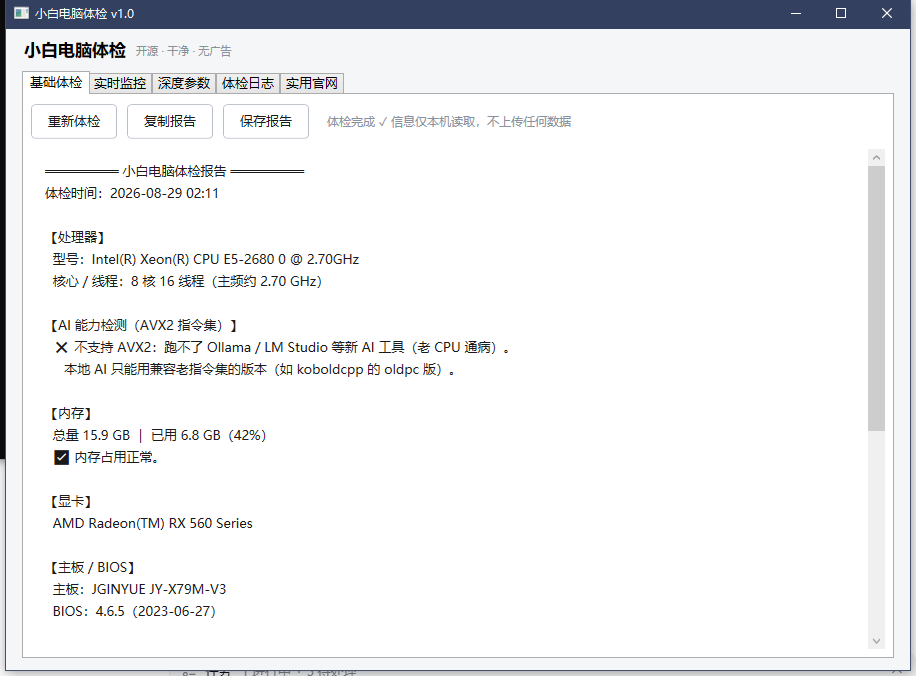
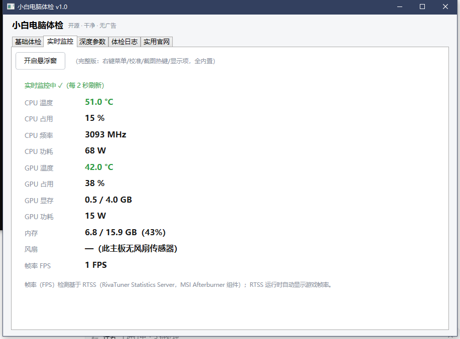
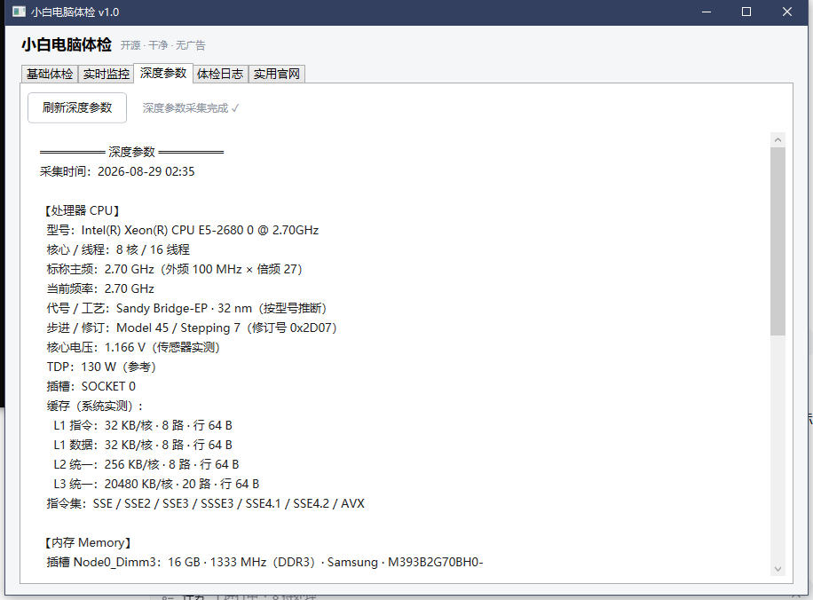

# 小白电脑体检（PC Check）

> 开源 · 干净 · 无广告 —— 一键看懂你的电脑（WPF 版 v1.0）

双击即用的一体式体检工具。**只读本机信息，不上传任何数据，不依赖任何外部程序。**

## 🤝 合作开发

本工具由 **_Lin_chan** 主创、**DeepSeek AI 助手** 协作开发——AI 负责编码实现与调试，作者负责方向与验收，共同迭代完成。

## 功能

- **基础体检**：硬件总览（处理器/内存/显卡/主板/BIOS/操作系统）+ AVX2 检测 + 磁盘体检 + 健康小结，一键复制/保存报告
- **实时监控**：内置传感器读取——CPU/GPU 温度、占用、频率、功耗、显存、内存、风扇，每 2 秒刷新，温度高自动变红；Xeon E5 v1 自动校准 -11°C
- **深度参数**：CPU/内存/显卡/主板关键规格一屏看全——L1/L2/L3 全缓存实测、代号/工艺按型号推断、外频×倍频、完整指令集、内存条详情、显卡规格库（代号/工艺/显存/位宽/带宽/着色器数）、驱动/BIOS（覆盖常用规格；专业级深度检测推荐用 CPU-Z/GPU-Z，见下方官网）

## 📸 界面预览

**基础体检**



**实时监控**



**深度参数**



> 更多说明见 [在线文档站](https://linlveo.github.io/pc-check/)

## 🛡️ 安全与误报说明（下载前必读）

- **需要管理员权限**：读取 CPU 温度/功耗需要访问硬件底层（ring0 驱动，来自 LibreHardwareMonitor 库），所以程序启动会弹 UAC 确认——属正常现象，不是病毒行为。
- **杀软误报**：该驱动方案（WinRing0 系）是杀软常见误报对象，Windows Defender 可能报"风险驱动/潜在威胁"——**属误报**。本工具**只读本机传感器，不上传任何数据，无任何网络通信**，源码全部公开可审计。
- **SmartScreen 提示**：程序未购买商业签名证书，首次运行可能弹"Windows 已保护你的电脑"，点 **"更多信息 → 仍要运行"** 即可。
- **处理误报**：如被杀软隔离，在杀软中添加信任/恢复即可；任何疑虑欢迎到 Issues 提问或直接审查源码。

## 使用

双击 `PcCheck.exe`，弹窗点“是”（需要管理员权限读取 CPU 温度），自动体检。

## 构建

```bash
dotnet publish PcCheck.csproj -c Release -r win-x64 --self-contained true -p:PublishSingleFile=true -o 发布
```

## 技术说明

- C# / .NET 8 WPF，极简界面（顶部 Tab）
- 数据来源：WMI（Win32_*）+ `GetLogicalProcessorInformation`（缓存实测）+ `IsProcessorFeaturePresent`（指令集）+ LibreHardwareMonitorLib 0.9.2（传感器）
- 显卡规格为内置公开规格库（表外型号提示可在仓库补充数据）
- 依赖：System.Management、LibreHardwareMonitorLib

## 许可

MIT

## 独立浮窗版（HardwareMonitor）

只要一个置顶监控小窗？独立浮窗版功能更全、更新更快：CPU/GPU 温度·占用·频率·功耗、内存、磁盘占用、网速、FPS/1% low（PresentMon ETW 采集，不依赖 RTSS，来源可自选）、最小化小方框、趋势曲线窗（1 秒采样，悬停回看对应时刻全部数据）、温度极值记录、历史日志、截图热键、数据接口 8080。

- 下载：https://github.com/LinLVEO/pc-check/releases/latest/download/HardwareMonitor-v1.2.0-win-x64.zip
- 源码：https://github.com/LinLVEO/hardware-monitor